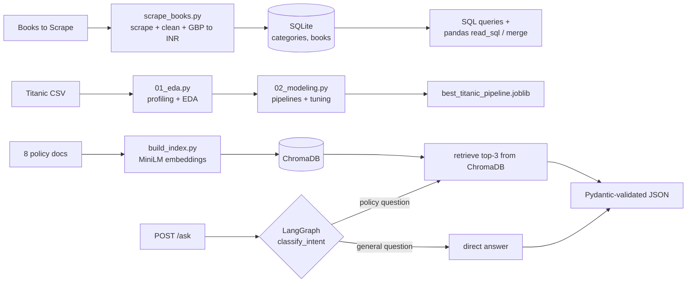

# Zepto Data & AI Platform

An end-to-end AI/ML engineering capstone with three connected modules: a **web-scraping ETL pipeline**, a **leakage-safe ML analytics workflow**, and a **RAG-based customer-support assistant** served through FastAPI and Docker.

Built for the Certificate Program in Artificial Intelligence and Machine Learning.

## Highlights

| Module | What it does | Key tech |
|---|---|---|
| **1. Data Pipeline** | Scrapes 148 books across 3 categories, cleans them, converts GBP to INR, loads a normalized SQLite database, and cross-checks SQL JOINs against pandas merges | requests, BeautifulSoup, pandas, SQLite |
| **2. Analytics & ML** | EDA plus classification, class-imbalance handling, hyperparameter tuning, and regression on the Titanic dataset, with a serialized end-to-end pipeline | scikit-learn, imbalanced-learn, seaborn, joblib |
| **3. Support Assistant** | Answers Zepto policy questions by retrieving from 8 policy documents, with intent routing and validated JSON output | Sentence Transformers, ChromaDB, LangGraph, Pydantic, FastAPI, Docker |

## Architecture



## Project structure

```text
zepto-ai-capstone/
├── data_pipeline/       # scraping, cleaning, SQLite, SQL + pandas analysis
├── analytics/           # EDA, modeling, charts, saved pipeline
├── support_assistant/   # RAG assistant, FastAPI app, Dockerfile
├── tests/               # unit and API tests
├── requirements.txt
├── requirements-dev.txt # pytest, httpx
└── README.md
```

Each module has its own README with task-level detail.

## Quick start

Requires Python 3.11+.

```bash
git clone https://github.com/bvkr2005/zepto-ai-capstone.git
cd zepto-ai-capstone

python -m venv .venv
source .venv/bin/activate        # Windows: .venv\Scripts\activate
pip install -r requirements.txt
```

### Module 1: data pipeline

```bash
python data_pipeline/scrape_books.py     # scrape, clean, convert -> cleaned_books.csv
python data_pipeline/database.py         # build normalized SQLite DB
python data_pipeline/sql_queries.py      # run SQL demos -> sql_query_outputs.txt
python data_pipeline/pandas_analysis.py  # SQL JOIN vs pandas merge check
```

### Module 2: analytics and ML

```bash
python analytics/01_eda.py         # profiling, cleaning, charts
python analytics/02_modeling.py    # modeling, tuning, saves best_titanic_pipeline.joblib
```

An offline copy of the dataset is included as `analytics/titanic.csv`.

### Module 3: support assistant

```bash
python support_assistant/build_index.py                    # embed docs into ChromaDB
uvicorn support_assistant.main:app --host 127.0.0.1 --port 8000
```

Then, in another terminal:

```bash
curl -X POST http://127.0.0.1:8000/ask \
  -H "Content-Type: application/json" \
  -d '{"query": "What is the delivery fee for a small Zepto order?"}'
```

Example response shape:

```json
{
  "answer": "Based on the retrieved context: Zepto delivers grocery and household essentials ...",
  "sources": ["doc_01", "doc_05", "doc_03"],
  "confidence": 1.0
}
```

**With Docker** (from the repo root):

```bash
docker build -f support_assistant/Dockerfile -t zepto-support-assistant .
docker run --rm -p 7860:7860 zepto-support-assistant
```

The API is then at `http://127.0.0.1:7860/ask`. The first run downloads the `all-MiniLM-L6-v2` embedding model, so it needs internet access once.

## Tests

```bash
pip install -r requirements-dev.txt
python -m pytest tests -v
```

The tests check the cleaned dataset (ranges, no nulls, fixed INR rate), the SQLite schema (row counts, foreign keys, SQL JOIN vs `pd.merge()`), the saved ML pipeline (predicts on raw rows with a missing age), and the `/ask` API (schema, routing, input validation). The API tests are skipped automatically if the assistant's dependencies or embedding model aren't available.

## Results

**Classification (Titanic survival, 80/20 stratified split, test set of 179 rows)**

| Model | Accuracy | Precision | Recall | F1 | ROC-AUC |
|---|---|---|---|---|---|
| Logistic Regression | 0.804 | 0.793 | 0.667 | 0.724 | **0.844** |
| Decision Tree | 0.793 | 0.864 | 0.551 | 0.673 | 0.829 |
| Random Forest | **0.816** | 0.800 | 0.696 | **0.744** | 0.830 |

- **Recommended model: Logistic Regression.** It has the best ROC-AUC and is the simplest and most interpretable of the three. Random Forest edges it on accuracy and F1 by about one point.
- **Class imbalance:** SMOTE raised recall from 0.667 to 0.783 (F1 0.724 to 0.761), slightly ahead of class weighting (F1 0.755).
- **Tuning:** GridSearchCV on Random Forest reached a cross-validated F1 of 0.746 and an OOB score of 0.827, but test F1 (0.718) did not beat the untuned baseline. On a dataset this small, tuning gains were not reliable.
- **Regression (Fare):** multivariate linear regression gave MAE 20.81, RMSE 30.47, R² 0.400, and heteroscedasticity was detected in the residuals.

## Engineering notes

- **No data leakage:** the train/test split happens before preprocessing, and imputation, scaling, and encoding live inside sklearn pipelines. SMOTE runs through an `imblearn` pipeline so it only touches training data.
- **Reproducible inference:** the full fitted pipeline (preprocessing and classifier) is saved with joblib and reloaded to predict on new passengers.
- **Normalized schema:** `categories` (1) to `books` (many) with a foreign key, and a check that a SQL JOIN matches `pd.merge()`.
- **Offline-first assistant:** embeddings and retrieval run locally. Answer generation is mocked by default (`MOCK_LLM=1`), and an optional real-LLM path with Pydantic validation and retries is available with `MOCK_LLM=0`.

## Limitations and next steps

- Intent routing is keyword-based; an embedding or LLM classifier would handle paraphrased questions better.
- In mock mode `confidence` is a fixed value of 1.0 rather than a calibrated score.
- Retrieval always returns the top 3 documents, even when some are only loosely relevant. A similarity threshold would filter them.
- Test coverage is basic. Price and rating cleaning still run inline inside `scrape_books.py`; extracting them into functions would make them unit-testable, and a CI workflow could run the suite on every push.
- The pipeline is batch-only; scheduling it with an orchestrator such as Airflow or Prefect would be a natural extension.
