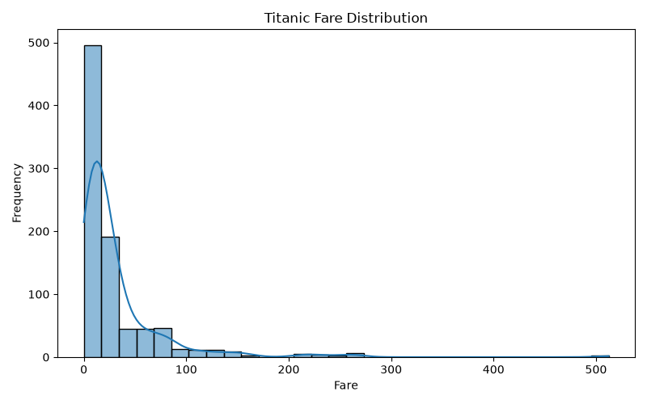
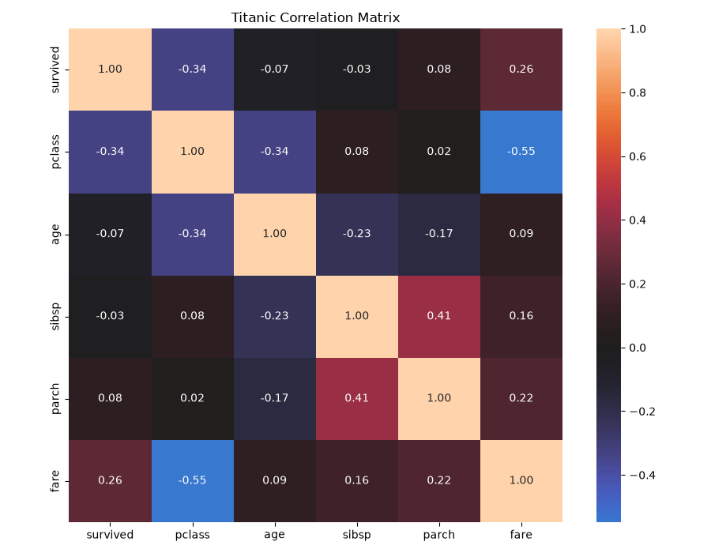
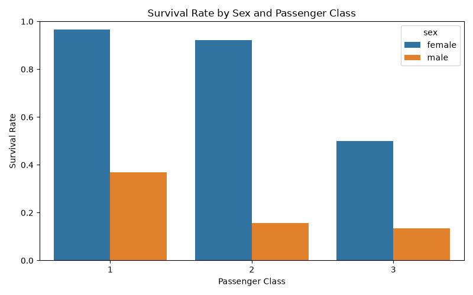
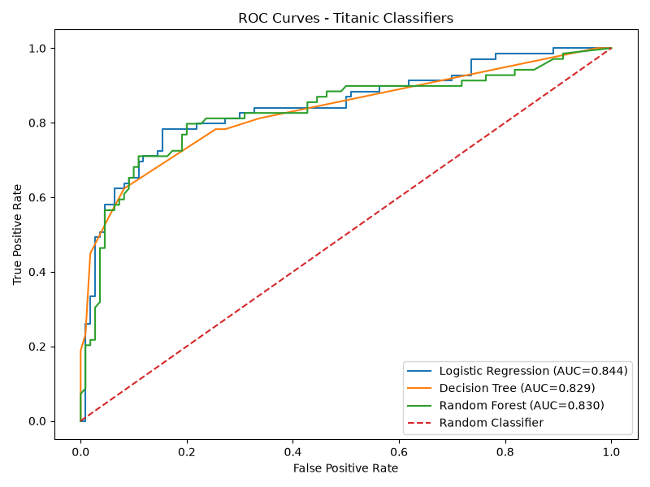
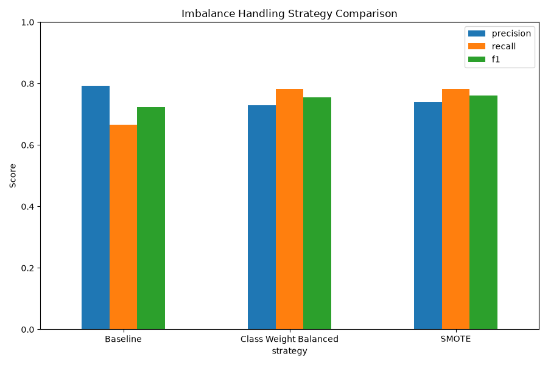
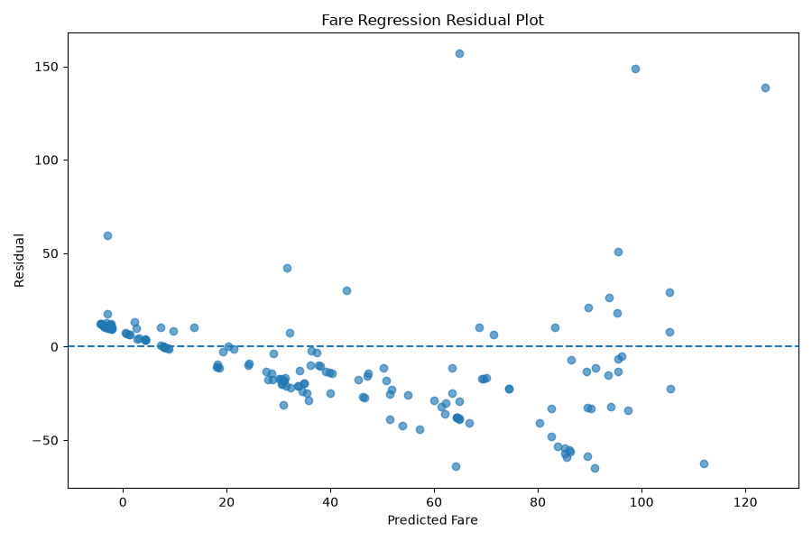

# Module 2: Analytics & Machine Learning

An end-to-end analytics and ML workflow on the Titanic dataset: profiling, cleaning, exploratory analysis, leakage-safe preprocessing, classification, class-imbalance handling, hyperparameter tuning, regression, and a serialized end-to-end pipeline.

## Contents

- [Files](#files)
- [How to run](#how-to-run)
- [Design decisions](#design-decisions)
- [Part A: Profiling, cleaning and data story](#part-a-profiling-cleaning-and-data-story)
- [Part B: Predictive modeling](#part-b-predictive-modeling)
- [Model selection](#model-selection)
- [Saved pipeline](#saved-pipeline)

## Files

| File | Purpose |
|---|---|
| `01_eda.py` | Tasks 1-6: profiling, cleaning, EDA, charts |
| `02_modeling.py` | Tasks 7-15: modeling, tuning, regression, saving the pipeline |
| `titanic.csv` | Offline copy of the dataset, saved right after the single `sns.load_dataset("titanic")` call |
| `best_titanic_pipeline.joblib` | Complete fitted pipeline (preprocessing + classifier) |
| `charts/` | Generated visualizations |
| `task*.csv`, `task*.txt` | Generated result tables and written conclusions |

## How to run

Run from the repository root:

```bash
python analytics/01_eda.py         # Tasks 1-6
python analytics/02_modeling.py    # Tasks 7-15
```

Run the EDA script first. The dataset is loaded once with Seaborn and saved as `titanic.csv`; all later work reads that file, so the project works offline.

## Design decisions

- The dataset is loaded once and cached to `titanic.csv` for offline reuse.
- Missing values in the EDA stage follow percentage thresholds: under 5% drop rows, 5-30% impute, very high drop the column.
- **The train/test split happens before any modeling preprocessing.** Imputation, scaling and encoding are fitted on training data only and applied to test data in transform-only mode.
- Numeric and categorical features use separate preprocessing pipelines inside a `ColumnTransformer`.
- SMOTE runs inside an `imblearn` pipeline, so only training data is ever oversampled.
- Random Forest hyperparameters are tuned with cross-validation.
- Classification and regression results are reported as separate metric groups because they solve different problems.
- The complete pipeline is saved, not just the final estimator, so raw data can be passed straight in.

---

# Part A: Profiling, cleaning and data story

## Task 1: Load and profile the dataset

The profile uses `df.info()`, `df.describe()`, `df.shape` and a missing-value percentage calculation.

- 891 rows and 15 columns
- Non-survivors: 549 (61.62%). Survivors: 342 (38.38%). The target is moderately imbalanced.

| Column | Missing % |
|---|---:|
| deck | 77.2166 |
| age | 19.8653 |
| embarked | 0.2245 |
| embark_town | 0.2245 |

## Task 2: Missing-value handling

| Column | Missing % | Rule | Action |
|---|---:|---|---|
| `deck` | 77.22 | Very high | Dropped the column |
| `age` | 19.87 | 5-30% | Median imputation (median age = 28.00) |
| `embarked` | 0.22 | Under 5% | Dropped the affected rows |
| `embark_town` | 0.22 | Under 5% | Dropped the affected rows |

Rows went from 891 to 889 (2 removed), with no missing values remaining.

## Task 3: Univariate analysis

Histograms and box plots for `age` and `fare`, with outliers found by the IQR rule (lower = Q1 - 1.5 x IQR, upper = Q3 + 1.5 x IQR).

| Variable | Q1 | Q3 | IQR | Lower bound | Upper bound | Outliers |
|---|---:|---:|---:|---:|---:|---:|
| age | 22.00 | 35.00 | 13.00 | 2.50 | 54.50 | 65 |
| fare | 7.90 | 31.00 | 23.10 | -26.76 | 65.66 | 114 |

Fare: mean 32.0967 > median 14.4542 > mode 8.0500, so the distribution is **right-skewed**. A small number of very high fares pull the mean up.



## Task 4: Bivariate analysis

Survival rates are computed with boolean masks (`&`, `|`).

| Group | Survival rate |
|---|---:|
| Female | 74.04% |
| Male | 18.89% |
| 1st class | 62.62% |
| 2nd class | 47.28% |
| 3rd class | 24.24% |

| Sex | Class | Survival rate |
|---|---:|---:|
| Female | 1 | 96.74% |
| Female | 2 | 92.11% |
| Female | 3 | 50.00% |
| Male | 1 | 36.89% |
| Male | 2 | 15.74% |
| Male | 3 | 13.54% |

Women survived at much higher rates within every class, and higher class helped within each sex.

**Correlation matrix** (exactly `survived`, `pclass`, `age`, `sibsp`, `parch`, `fare`; the derived `adult_male` and `alone` columns are excluded). The two strongest off-diagonal pairs by absolute value:

1. `pclass` vs `fare`: **-0.5482**. Lower class numbers (first class) paid higher fares.
2. `sibsp` vs `parch`: **+0.4145**. Passengers with siblings or spouses also tended to travel with parents or children.



## Task 5: Multivariate data story

Four visualizations, each with a written interpretation:

1. **Survival by sex:** 74.04% for women vs 18.89% for men. Sex is strongly associated with survival.
2. **Survival by class:** survival falls from 62.62% to 47.28% to 24.24% moving from first to third class.
3. **Survival by sex and class:** first-class women survived at 96.74% and third-class women at 50.00%. First-class men survived at 36.89% and third-class men at 13.54%. Being female was the major advantage, and higher class added another.
4. **Age vs fare by survival:** both survivors and non-survivors appear across all ages, so age alone did not decide survival. Survivors' median fare was 26.00 vs 10.50 for non-survivors, which supports the class findings.



## Task 6: Standardization check

An exploratory z-score check, `z = (x - mean) / std`, on `age` and `fare`.

| Feature | Mean before | Std before | Mean after | Std after |
|---|---:|---:|---:|---:|
| age | 29.315152 | 12.977627 | about 0 | about 1 |
| fare | 32.096681 | 49.669545 | about 0 | about 1 |

This was only an EDA sanity check and is **not** used for modeling. The modeling pipeline fits its own `StandardScaler` on training data only.

---

# Part B: Predictive modeling

## Task 7: Stratified train/test split

Target: `survived`. Features: `pclass`, `sex`, `age`, `sibsp`, `parch`, `fare`, `embarked`. The split is 80/20 and stratified so both sets keep the same class balance.

| Dataset | Rows | Not survived | Survived |
|---|---:|---:|---:|
| Full | 891 | 61.62% | 38.38% |
| Train | 712 | 61.66% | 38.34% |
| Test | 179 | 61.45% | 38.55% |

## Task 8: Preprocessing (train-only fit)

A `ColumnTransformer` with two branches:

- **Numeric** (`pclass`, `age`, `sibsp`, `parch`, `fare`): median imputation, then `StandardScaler`
- **Categorical** (`sex`, `embarked`): most-frequent imputation, then `OneHotEncoder`

All steps are fitted on the training data only and applied to the test data with `transform`, so no test information leaks into training.

## Task 9: Classification models

Logistic Regression, Decision Tree and Random Forest are trained on the same split. The Decision Tree is also drawn with `plot_tree()`.

## Task 10: Classification evaluation

Each model is scored with a confusion matrix, accuracy, precision, recall, F1, ROC curve and AUC.

| Model | Accuracy | Precision | Recall | F1 | AUC |
|---|---:|---:|---:|---:|---:|
| Logistic Regression | 0.8045 | 0.7931 | 0.6667 | 0.7244 | **0.8437** |
| Decision Tree | 0.7933 | **0.8636** | 0.5507 | 0.6726 | 0.8292 |
| Random Forest | **0.8156** | 0.8000 | **0.6957** | **0.7442** | 0.8300 |

Random Forest is best on accuracy and F1, Logistic Regression on ROC-AUC, and the Decision Tree on precision, though its low recall gives it the lowest F1.



## Task 11: Class imbalance

Three strategies are compared using Logistic Regression: no handling, `class_weight="balanced"`, and SMOTE (training data only).

| Strategy | Precision | Recall | F1 |
|---|---:|---:|---:|
| Baseline | 0.7931 | 0.6667 | 0.7244 |
| Class weight balanced | 0.7297 | 0.7826 | 0.7552 |
| SMOTE | 0.7397 | 0.7826 | **0.7606** |

SMOTE gave the best precision-recall balance. Both strategies trade some precision for a clear gain in recall.



## Task 12: Hyperparameter tuning

`GridSearchCV` (5-fold CV, F1 scoring) over a Random Forest with `oob_score=True` and `random_state=42`:

| Parameter | Values searched |
|---|---|
| `n_estimators` | 100, 200 |
| `max_depth` | None, 5, 10 |
| `max_features` | sqrt, log2 |

Best parameters: `n_estimators=100`, `max_depth=5`, `max_features="sqrt"`. Best cross-validated F1: **0.7459**. OOB score: **0.8272**.

| Test metric | Tuned RF |
|---|---:|
| Accuracy | 0.8156 |
| Precision | 0.8750 |
| Recall | 0.6087 |
| F1 | 0.7179 |
| AUC | 0.8431 |

Precision and AUC improved, but recall dropped, and the test F1 (0.7179) is slightly **below** the untuned Random Forest (0.7442). On a test set of only 179 rows, this tuning did not deliver a reliable gain.

## Task 13: Regression (predicting fare)

A multivariate Linear Regression on the remaining passenger features.

| Metric | Result |
|---|---:|
| MAE | 20.8094 |
| RMSE | 30.4731 |
| R² | 0.3999 |
| Adjusted R² | 0.3679 |

The model explains about 40% of the variation in fare. The residual plot shows **heteroscedasticity** (residual spread changes with predicted fare), so the constant-variance assumption of ordinary linear regression is not fully met.



---

# Model selection

Classification and regression metrics are reported separately (Task 14) because they measure different problems.

**Recommended classifier: Logistic Regression.** The selection logic ranks models by ROC-AUC first and F1 second. Logistic Regression has the highest ROC-AUC (0.8437), and its accuracy of 0.8045 is close to Random Forest's 0.8156.

Why AUC first: it measures how well a model separates survivors from non-survivors across all thresholds, so it is not tied to a single 0.5 cutoff, and it is less affected by the class imbalance than accuracy is.

Why the choice is not clear-cut: Random Forest leads on accuracy (+1.1 points) and F1 (+2.0 points), and with only 179 test rows those gaps could easily reflect the particular split rather than a real difference. Logistic Regression is also simpler, faster and easier to interpret, which counts for a deployment candidate. Tuning did not change this picture (see Task 12).

Given more time, the next step would be repeated cross-validation on the full comparison to see whether the ranking holds.

---

# Saved pipeline

The best deployment candidate is saved as one complete fitted pipeline:

```python
import joblib, pandas as pd

pipeline = joblib.load("analytics/best_titanic_pipeline.joblib")

passengers = pd.DataFrame([
    {"pclass": 1, "sex": "female", "age": 29.0, "sibsp": 0, "parch": 0, "fare": 80.0, "embarked": "S"},
    {"pclass": 3, "sex": "male",   "age": None, "sibsp": 0, "parch": 0, "fare": 8.0,  "embarked": "S"},
])

print(pipeline.predict(passengers))
print(pipeline.predict_proba(passengers)[:, 1])
```

Because preprocessing is saved inside the pipeline, raw records (including the missing age above) go straight in. The reload test produced these predictions:

| Passenger | Predicted survived | Survival probability |
|---|---:|---:|
| 1st-class woman, age 29 | 1 | 0.933 |
| 3rd-class man, age missing | 0 | 0.088 |

## Generated output files

`task7_split_summary.csv`, `task8_preprocessing_summary.csv`, `task10_model_comparison.csv`, `task11_imbalance_comparison.csv`, `task11_imbalance_conclusion.txt`, `task12_random_forest_tuning.csv`, `task13_regression_metrics.csv`, `task13_regression_conclusion.txt`, `task14_final_model_comparison.csv`, `task14_final_recommendation.txt`, `task15_reload_prediction.csv`, `best_titanic_pipeline.joblib`. Charts are in `charts/`.

## Note on loading the saved model

Pickled scikit-learn models should be loaded with the same scikit-learn version that saved them. This one was saved with 1.9.0, which `requirements.txt` pins.
